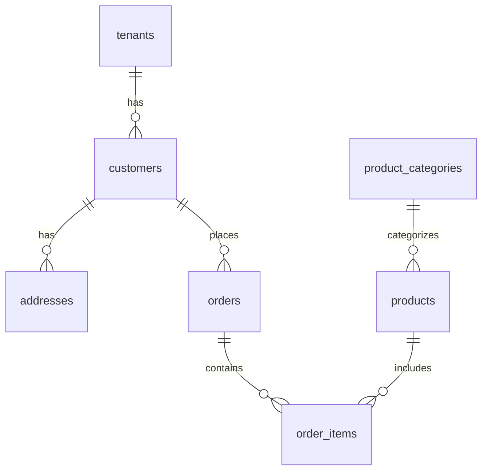

# Çiçek CRM Projesi

## 1. Proje Genel Tanımlar

### 1.1 Amaç ve Hedefler
- **Müşteri Yönetimi**
  - Müşteri profili ve geçmiş siparişler
  - Özel günler ve hatırlatmalar
  - Adres yönetimi ve HERE Maps entegrasyonu
  - Kurumsal/bireysel müşteri ayrımı

- **Sipariş Yönetimi**
  - Tek ekranda hızlı sipariş girişi
  - Teslimat planlama ve rota optimizasyonu
  - Durum takibi ve bildirimler
  - Ödeme takibi ve raporlama

- **Envanter Kontrolü**
  - Stok takibi ve kritik seviye uyarıları
  - Tedarikçi yönetimi
  - Satın alma planlaması
  - Ürün kategorileri ve fiyatlandırma

- **Finans Takibi**
  - Günlük/aylık gelir raporları
  - Kar marjı hesaplamaları
  - Ödeme metodları analizi
  - Borç/alacak takibi

### 1.2 Teknoloji Stack
- **Frontend**
  - HTML5 + CSS3 
  - Vanilla JavaScript (ES6+)
  - Bootstrap 5.3.2
  - Bootstrap Icons
  - Modüler JavaScript mimarisi
  - LocalStorage/SessionStorage kullanımı

- **Backend**
  - Cloudflare Workers (Edge Computing)
  - TypeScript
  - Hono.js Framework
  - REST API
  - JWT Authentication (TODO)

- **Veritabanı**
  - Cloudflare D1 (SQLite)
  - İlişkisel veri modeli
  - Soft delete yaklaşımı
  - Audit logging
  - Multi-tenant mimari

- **Entegrasyonlar**
  - HERE Maps Platform
    - Geocoding API
    - Places API
    - Routing API
  - SMS API (TODO)
  - Payment Gateway (TODO)

## 2. Klasör Yapısı ve Dosya Organizasyonu

### 2.1 Ana Dizin Yapısı
```
/CCRM/
├── docs/                        # Dokümantasyon
├── migrations/                  # Veritabanı
├── public/                     # Frontend
└── workers/                    # Backend
```

### 2.2 Frontend Yapısı (/public)
```
public/
├── calendar/                   # Takvim Modülü
│   ├── calendar.js            # Takvim işlemleri
│   └── index.html            # Takvim görünümü
├── common/                    # Ortak Bileşenler
│   ├── header.html           # Üst menü
│   └── layout.html           # Ana şablon
├── css/                      # Stil Dosyaları
├── js/                       # JavaScript
│   ├── components/          # UI Bileşenleri
│   │   ├── address-form.js  # Adres formu
│   │   └── address-select.js # Adres seçici
│   └── services/            # Servis Katmanı
│       └── address-service.js # HERE entegrasyonu
└── modules/                  # İş Modülleri
    ├── customers/           # Müşteri Yönetimi
    ├── delivery/            # Teslimat Yönetimi
    ├── finance/             # Finans Yönetimi
    └── orders/              # Sipariş Yönetimi
```

### 2.3 Backend Yapısı (/workers)
```
workers/
├── src/
│   ├── handlers/            # API İşleyicileri
│   ├── middleware/          # Ara Katman
│   ├── models/             # Veri Modelleri
│   └── utils/              # Yardımcı Fonksiyonlar
├── worker.ts               # Ana Worker
└── wrangler.toml          # Worker Konfigürasyonu
```

## 3. Veritabanı Yapısı

### 3.1 Ana Tablolar ve İlişkiler


#### Önemli İş Kuralları
- Her müşterinin birden fazla adresi olabilir
- Siparişler tek bir adrese bağlıdır
- Soft delete tüm ana tablolarda aktiftir
- Her kayıt tenant_id ile izole edilir

#### Tetikleyiciler (Triggers)
```sql
# Müşteri Güncellemelerini İzleme
audit_customers_update: Müşteri değişikliklerini loglar
audit_customers_insert: Yeni müşteri kayıtlarını loglar
audit_customers_delete: Müşteri silmelerini loglar

# Otomatik Alan Güncellemeleri
update_customers_updated_at: updated_at alanını günceller
soft_delete_customers_propagate: Müşteri silindiğinde siparişleri de siler
```

#### İndeks Stratejisi
```sql
# Performans Kritik İndeksler
idx_customers_phone: Telefon ile hızlı müşteri arama
idx_orders_delivery_date_status: Teslimat tarihine göre sipariş listeleme
idx_addresses_customer: Müşteri adreslerini hızlı getirme

# Tenant İzolasyon İndeksleri
idx_customers_tenant: Müşteri tenant filtresi
idx_orders_tenant: Sipariş tenant filtresi
```

### 3.2 Tablo Detayları

#### Tenant Yönetimi
- **tenants**
  - Multi-tenant yapı için temel tablo
  - Domain bazlı tenant ayrımı
  - Firma bilgileri ve ayarları

#### Müşteri Yönetimi
- **customers**
  - Temel müşteri bilgileri
  - Müşteri tipleri (bireysel/kurumsal)
  - Özel günler ve notlar
  - Soft delete desteği

- **addresses**
  - HERE Maps entegrasyonu
  - Çoklu adres desteği
  - Coğrafi koordinatlar
  - Varsayılan adres işaretleme

#### Sipariş Yönetimi
- **orders**
  - Teslimat bilgileri
  - Ödeme detayları
  - Durum takibi
  - Maliyet ve kar hesabı

- **order_items**
  - Sipariş kalemleri
  - Birim fiyat ve miktar
  - Maliyet takibi

### 3.3 Görünümler ve Raporlar
- **finance_stats**
  - Günlük gelir/gider özeti
  - Kar marjı hesaplamaları
  - Trend analizleri

- **delivery_stats**
  - Teslimat performansı
  - Bölge bazlı analizler
  - Zaman dilimi analizleri

## 4. API Yapısı ve Endpointler

### 4.1 API Güvenliği
- Tenant bazlı izolasyon
- Rate limiting (TODO)
- JWT authentication (TODO)
- CORS politikaları

### 4.2 Endpoint Grupları

#### Dashboard API
```typescript
GET /api/dashboard
  → Günlük teslimat özeti
  → Finansal durum
  → Kritik stok bildirimleri
```

#### Sipariş API
```typescript
GET /orders
POST /orders
GET /orders/filtered
  → Tarih filtreleme
  → Durum filtreleme
  → Sayfalama
PUT /orders/:id/status
  → Durum güncelleme
  → Otomatik bildirim
```

#### Müşteri API
```typescript
GET /customers
POST /customers
GET /customers/search/phone/:phone
  → Hızlı müşteri arama
  → Otomatik format düzeltme
GET /customers/:id/addresses
  → Adres listesi
  → Varsayılan adres
```

### 4.1 Önemli İş Mantığı

#### Sipariş İşlemleri
```typescript
# Sipariş Oluşturma Kuralları
- Teslimat adresi zorunlu (delivery_address_id)
- Teslimat türü belirtilmeli (delivery_type)
- Alıcı bilgileri eksiksiz olmalı
- Toplam tutar ve maliyet hesaplanmalı

# Sipariş Durumları
new -> preparing -> ready -> delivering -> delivered
            ↓
         cancelled
```

#### Müşteri İşlemleri
```typescript
# Müşteri Arama Stratejisi
1. Önce telefon ile tam eşleşme
2. Telefon formatı standardizasyonu
3. Aktif kayıtlarda arama (is_deleted=0)

# Adres Yönetimi
- HERE Maps entegrasyonu
- Koordinat zorunluluğu
- Varsayılan adres kontrolü
```

### 4.2 Hata Yönetimi
```typescript
# Genel Hata Kodları
400: Eksik/Hatalı parametre
404: Kayıt bulunamadı
409: Çakışma (örn: telefon kayıtlı)
500: Sunucu hatası

# Hata Yanıt Formatı
{
  error: string,
  details?: string,
  code?: string
}
```

## 5. Kod Kuralları ve Geliştirme Süreci

### 5.1 Kod Formatı
- 2 space indentation
- Semicolon zorunlu
- Single quote string
- TypeScript strict mode

### 5.2 Git Stratejisi
```bash
# Branch İsimlendirme
feature/[özellik-adı]
bugfix/[hata-açıklaması]
hotfix/[acil-düzeltme]

# Commit Mesajları
feat: Yeni özellik eklendi
fix: Hata düzeltmesi
docs: Dokümantasyon güncellemesi
style: Kod formatı düzenlemesi
refactor: Kod iyileştirmesi
test: Test ekleme/düzenleme
```

### 5.3 Deployment Süreci
```bash
# 1. Development Ortamı
npm run dev
wrangler dev

# 2. Staging Ortamı (TODO)
npm run build:staging
wrangler deploy --env staging

# 3. Production Ortamı
npm run build
wrangler deploy
```

### 5.4 Database Migrations
```bash
# Schema Güncelleme
wrangler d1 execute cicek-crm-db \
  --remote \
  --file=./migrations/schema.sql

# Test Verisi
wrangler d1 execute cicek-crm-db \
  --remote \
  --file=./migrations/data.sql
```

### 5.5 Monitoring ve Logging
- Cloudflare Analytics
- Custom error tracking
- Performance monitoring
- Usage statistics

## 6. Planlanan Geliştirmeler

### 6.1 Kısa Vadeli (1-2 Ay)
- JWT authentication
- SMS entegrasyonu
- Rota optimizasyonu
- Stok yönetimi geliştirmeleri

### 6.2 Orta Vadeli (3-6 Ay)
- Mobile responsive UI
- Payment gateway
- Bildirim sistemi
- Raporlama geliştirmeleri

### 6.3 Uzun Vadeli (6+ Ay)
- Mobile uygulama
- AI destekli öneriler
- Tedarikçi portalı
- Marketplace entegrasyonu


#silinecek

git add .
git commit -m "2"
git push origin development

git push origin development:main

cd workers
wrangler deploy