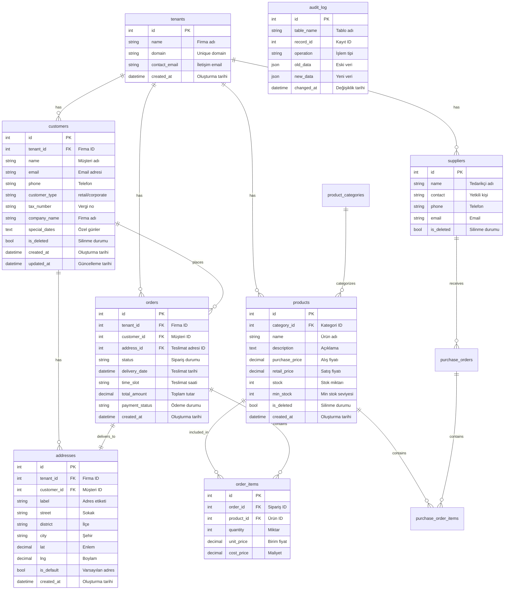

# Veritabanı Şeması

## 1. Entity-Relationship Diyagramı



## 2. Tablo Detayları ve Constraints

### tenants
```sql
CREATE TABLE tenants (
    id INTEGER PRIMARY KEY AUTOINCREMENT,
    name TEXT NOT NULL,
    domain TEXT UNIQUE,
    contact_email TEXT CHECK (contact_email LIKE '%@%.%'),
    created_at DATETIME DEFAULT CURRENT_TIMESTAMP
);
```

### customers 
```sql
CREATE TABLE customers (
    id INTEGER PRIMARY KEY AUTOINCREMENT,
    tenant_id INTEGER NOT NULL,
    name TEXT NOT NULL,
    email TEXT CHECK (email LIKE '%@%.%'),
    phone TEXT NOT NULL,
    customer_type TEXT CHECK (customer_type IN ('retail', 'corporate')),
    tax_number TEXT CHECK (tax_number IS NULL OR tax_number GLOB '[0-9]*'),
    company_name TEXT,
    special_dates TEXT,
    is_deleted BOOLEAN DEFAULT 0,
    created_at DATETIME DEFAULT CURRENT_TIMESTAMP,
    updated_at DATETIME DEFAULT CURRENT_TIMESTAMP,
    FOREIGN KEY (tenant_id) REFERENCES tenants(id) ON DELETE CASCADE
);
```

### addresses
```sql
CREATE TABLE addresses (
    id INTEGER PRIMARY KEY AUTOINCREMENT,
    tenant_id INTEGER NOT NULL,
    customer_id INTEGER NOT NULL,
    label TEXT NOT NULL,
    street TEXT,
    district TEXT NOT NULL,
    city TEXT NOT NULL DEFAULT 'İstanbul',
    lat DECIMAL(10,8),
    lng DECIMAL(11,8),
    is_default BOOLEAN DEFAULT 0,
    created_at DATETIME DEFAULT CURRENT_TIMESTAMP,
    FOREIGN KEY (tenant_id) REFERENCES tenants(id),
    FOREIGN KEY (customer_id) REFERENCES customers(id)
);
```

### orders
```sql
CREATE TABLE orders (
    id INTEGER PRIMARY KEY AUTOINCREMENT,
    tenant_id INTEGER NOT NULL,
    customer_id INTEGER NOT NULL,
    delivery_address_id INTEGER,
    status TEXT CHECK (status IN ('new','preparing','ready','delivering','delivered','cancelled')),
    delivery_date DATETIME NOT NULL,
    delivery_time_slot TEXT CHECK (delivery_time_slot IN ('morning','afternoon','evening')),
    recipient_name TEXT NOT NULL,
    recipient_phone TEXT NOT NULL,
    card_message TEXT,
    payment_method TEXT CHECK (payment_method IN ('cash','credit_card','bank_transfer')),
    payment_status TEXT CHECK (payment_status IN ('pending','paid','refunded')),
    subtotal DECIMAL(10,2) NOT NULL,
    delivery_fee DECIMAL(10,2) DEFAULT 0,
    total_amount DECIMAL(10,2) NOT NULL,
    is_deleted BOOLEAN DEFAULT 0,
    created_at DATETIME DEFAULT CURRENT_TIMESTAMP,
    FOREIGN KEY (customer_id) REFERENCES customers(id),
    FOREIGN KEY (delivery_address_id) REFERENCES addresses(id),
    FOREIGN KEY (tenant_id) REFERENCES tenants(id)
);
```

## 3. İndeksler

### Performans İndeksleri
```sql
-- Müşteri aramaları için
CREATE INDEX idx_customers_phone ON customers(phone);
CREATE INDEX idx_customers_email ON customers(email);

-- Sipariş listeleme/filtreleme için
CREATE INDEX idx_orders_delivery_date ON orders(delivery_date);
CREATE INDEX idx_orders_status ON orders(status);
CREATE INDEX idx_orders_customer ON orders(customer_id);

-- Adres aramaları için
CREATE INDEX idx_addresses_district ON addresses(district);
CREATE INDEX idx_addresses_city ON addresses(city);
```

### Tenant İzolasyon İndeksleri
```sql
CREATE INDEX idx_customers_tenant ON customers(tenant_id);
CREATE INDEX idx_orders_tenant ON orders(tenant_id);
CREATE INDEX idx_products_tenant ON products(tenant_id);
CREATE INDEX idx_addresses_tenant ON addresses(tenant_id);
```

## 4. Viewlar

### finance_stats
```sql
CREATE VIEW finance_stats AS
SELECT 
    DATE(created_at) as date,
    COUNT(*) as total_orders,
    SUM(total_amount) as revenue,
    SUM(cost_price) as costs,
    (SUM(total_amount) - SUM(cost_price)) as profit
FROM orders
WHERE status != 'cancelled'
GROUP BY DATE(created_at);
```

### delivery_stats
```sql
CREATE VIEW delivery_stats AS
SELECT 
    DATE(delivery_date) as date,
    delivery_time_slot,
    COUNT(*) as total_deliveries,
    SUM(CASE WHEN status = 'delivered' THEN 1 ELSE 0 END) as completed,
    AVG(delivery_fee) as avg_fee
FROM orders
GROUP BY DATE(delivery_date), delivery_time_slot;
```

## 5. Triggerlar

### Audit Logging
```sql
CREATE TRIGGER audit_customers_update 
AFTER UPDATE ON customers 
FOR EACH ROW 
BEGIN
    INSERT INTO audit_log (table_name, record_id, operation, old_data, new_data)
    VALUES (
        'customers',
        OLD.id,
        'UPDATE',
        json_object('name', OLD.name, 'phone', OLD.phone),
        json_object('name', NEW.name, 'phone', NEW.phone)
    );
END;
```

### Timestamp Updates
```sql
CREATE TRIGGER update_customers_timestamp
AFTER UPDATE ON customers
FOR EACH ROW
BEGIN
    UPDATE customers 
    SET updated_at = CURRENT_TIMESTAMP 
    WHERE id = OLD.id;
END;
```

### Cascade Soft Delete
```sql
CREATE TRIGGER soft_delete_cascade
AFTER UPDATE OF is_deleted ON customers
FOR EACH ROW WHEN NEW.is_deleted = 1
BEGIN
    UPDATE orders SET is_deleted = 1 WHERE customer_id = OLD.id;
    UPDATE addresses SET is_deleted = 1 WHERE customer_id = OLD.id;
END;
```