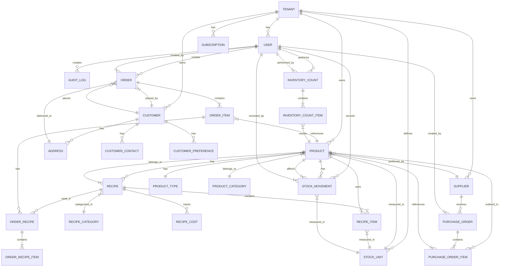

```mermaid
erDiagram
    %% Tenant İlişkileri
    TENANT ||--o{ USER : has
    TENANT ||--o{ SUBSCRIPTION : has
    TENANT ||--o{ CUSTOMER : owns
    TENANT ||--o{ PRODUCT : owns
    TENANT ||--o{ SUPPLIER : owns
    TENANT ||--o{ STOCK_UNIT : defines

    %% Kullanıcı İlişkileri
    USER ||--o{ AUDIT_LOG : creates
    USER ||--o{ ORDER : creates
    USER ||--o{ INVENTORY_COUNT : performs
    USER ||--o{ STOCK_MOVEMENT : records

    %% Müşteri İlişkileri
    CUSTOMER ||--o{ ORDER : places
    CUSTOMER ||--o{ ADDRESS : has
    CUSTOMER ||--o{ CUSTOMER_CONTACT : has
    CUSTOMER ||--o{ CUSTOMER_PREFERENCE : has

    %% Ürün ve Stok İlişkileri
    PRODUCT }|--|| PRODUCT_TYPE : has
    PRODUCT }|--|| PRODUCT_CATEGORY : belongs_to
    PRODUCT ||--o{ STOCK_MOVEMENT : has
    PRODUCT ||--o{ RECIPE : has
    PRODUCT }|--|| STOCK_UNIT : measured_in
    PRODUCT }o--|| SUPPLIER : preferred_by
    PRODUCT ||--o{ PURCHASE_ORDER_ITEM : ordered_in

    %% Reçete İlişkileri
    RECIPE ||--|{ RECIPE_ITEM : contains
    RECIPE }|--|| PRODUCT : belongs_to
    RECIPE }|--|| RECIPE_CATEGORY : categorized_in
    RECIPE_ITEM }|--|| PRODUCT : uses
    RECIPE_ITEM }|--|| STOCK_UNIT : measured_in
    RECIPE ||--o{ RECIPE_COST : tracks
    RECIPE ||--o{ ORDER_RECIPE : used_in

    %% Sipariş İlişkileri
    ORDER ||--|{ ORDER_ITEM : contains
    ORDER }|--|| CUSTOMER : placed_by
    ORDER }|--|| ADDRESS : delivered_to
    ORDER }|--|| USER : created_by
    ORDER_ITEM }|--|| PRODUCT : references
    ORDER_ITEM ||--o{ ORDER_RECIPE : has
    ORDER_RECIPE ||--|{ ORDER_RECIPE_ITEM : contains

    %% Stok Yönetimi
    SUPPLIER ||--o{ PURCHASE_ORDER : receives
    PURCHASE_ORDER ||--|{ PURCHASE_ORDER_ITEM : contains
    PURCHASE_ORDER }|--|| USER : created_by
    PURCHASE_ORDER_ITEM }|--|| PRODUCT : references
    INVENTORY_COUNT ||--|{ INVENTORY_COUNT_ITEM : contains
    INVENTORY_COUNT }|--|| USER : performed_by
    INVENTORY_COUNT_ITEM }|--|| PRODUCT : counts
    STOCK_MOVEMENT }|--|| PRODUCT : affects
    STOCK_MOVEMENT }|--|| USER : recorded_by
    STOCK_MOVEMENT }|--|| STOCK_UNIT : measured_in
```