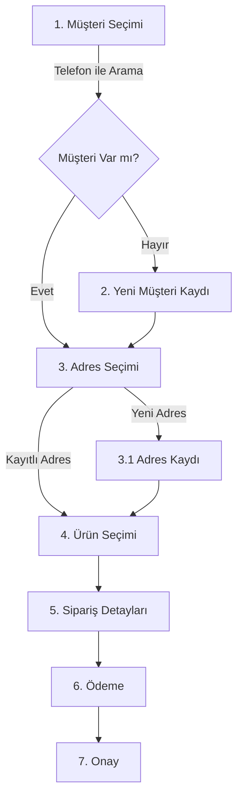

# Sipariş Oluşturma Süreci

## 1. Süreç Akışı



## 2. Adımlar ve Validasyonlar

### 2.1 Müşteri Seçimi
- Telefon numarası ile arama (`/customers/phone/:phone`)
- Girdi formatı: 10 haneli numara
- Çıktı: Müşteri bilgileri veya "bulunamadı"

### 2.2 Yeni Müşteri Kaydı
```javascript
POST /customers
{
    name: string,          // Zorunlu
    phone: string,         // Zorunlu, unique
    email: string,         // Opsiyonel
    customer_type: enum,   // retail/corporate
    tax_number?: string,   // Kurumsal ise zorunlu
    company_name?: string  // Kurumsal ise zorunlu
}
```

### 2.3 Adres İşlemleri
```javascript
// Adres Listesi
GET /customers/:id/addresses

// Yeni Adres
POST /customers/:id/addresses
{
    label: string,      // Ev, İş vb.
    street: string,     // Sokak/Cadde
    district: string,   // İlçe
    city: string,       // Şehir
    coordinates: {      // HERE Maps
        lat: number,
        lng: number
    }
}
```

### 2.4 Ürün Seçimi
```javascript
// Ürün Ekleme
{
    product_id: number,
    quantity: number,
    unit_price: number,
    notes?: string
}

// Validasyonlar
- Minimum 1 ürün
- Yeterli stok kontrolü
- Geçerli fiyat kontrolü
```

### 2.5 Teslimat Bilgileri
```javascript
{
    delivery_date: Date,        // Bugün veya sonrası
    delivery_time_slot: enum,   // morning/afternoon/evening
    recipient_name: string,     // Zorunlu
    recipient_phone: string,    // Zorunlu
    card_message?: string,      // Opsiyonel
    delivery_notes?: string     // Opsiyonel
}
```

## 3. API Endpoint

### 3.1 Sipariş Oluşturma
```javascript
POST /orders
{
    // Müşteri Bilgileri
    customer_id: number,
    delivery_address_id: number,
    
    // Teslimat Bilgileri
    delivery_date: string,          // YYYY-MM-DD
    delivery_time_slot: string,     // morning/afternoon/evening
    recipient_name: string,
    recipient_phone: string,
    card_message?: string,
    
    // Ödeme Bilgileri
    payment_method: string,         // cash/credit_card/bank_transfer
    
    // Ürünler
    items: [{
        product_id: number,
        quantity: number,
        unit_price: number
    }]
}
```

### 3.2 Response Format
```javascript
// Başarılı
{
    success: true,
    order_id: number,
    total_amount: number,
    estimated_delivery: string
}

// Hata
{
    error: string,
    code: string,
    details?: string
}
```

## 4. Hata Kontrolleri

### 4.1 Validasyon Hataları
```javascript
- Müşteri bulunamadı (404)
- Adres bulunamadı (404)
- Yetersiz stok (400)
- Geçersiz teslimat tarihi (400)
- Eksik zorunlu alan (400)
```

### 4.2 İş Kuralı Kontrolleri
```javascript
- Mesai saatleri kontrolü
- Minimum sipariş tutarı
- Teslimat bölgesi kontrolü
- Kapasite kontrolü
```

## 5. Örnek Kullanım

### 5.1 Başarılı Senaryo
```javascript
// 1. Müşteri Arama
const customer = await fetch(`${API_URL}/customers/phone/5551234567`);

// 2. Adres Seçimi
const addresses = await fetch(`${API_URL}/customers/${customer.id}/addresses`);

// 3. Sipariş Oluşturma
const order = await fetch(`${API_URL}/orders`, {
    method: 'POST',
    body: JSON.stringify({
        customer_id: customer.id,
        delivery_address_id: addresses[0].id,
        delivery_date: '2024-01-20',
        delivery_time_slot: 'morning',
        recipient_name: 'Ahmet Yılmaz',
        recipient_phone: '5551234567',
        payment_method: 'credit_card',
        items: [{
            product_id: 1,
            quantity: 1,
            unit_price: 150.00
        }]
    })
});
```

### 5.2 Hata Senaryosu
```javascript
try {
    const response = await createOrder(orderData);
    if (!response.ok) {
        const error = await response.json();
        switch(error.code) {
            case 'INVALID_DATE':
                showError('Geçersiz teslimat tarihi');
                break;
            case 'OUT_OF_STOCK':
                showError('Yetersiz stok');
                break;
            default:
                showError('Sipariş oluşturulamadı');
        }
    }
} catch (error) {
    showError('Bağlantı hatası');
}
```