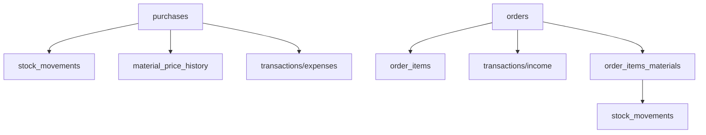

-- filepath: /Users/yusuf/Downloads/kod/CCRM/docs/product-workflow.md
# Çiçek CRM - Yeni İş Akışı

## 1. Tedarikçi Süreci
1. Satın alma kaydı oluşturulur (purchases.html)
   - Tedarikçi seçilir
   - Malzemeler ve miktarlar girilir
   - Birim fiyatlar girilir
2. Kayıt sonrası otomatik olarak:
   - Stok girişi yapılır (stock_movements)
   - Malzeme fiyat geçmişi güncellenir (material_price_history)
   - Ödeme kaydı expenses.html'e düşer (transactions tablosu)

## 2. Sipariş Süreci
1. Sipariş Girişi (orders.html)
   - Müşteri/alıcı bilgileri
   - Teslimat bilgileri
   - Ürün seçimi ve adet
   - Fiyatlandırma
2. Kayıt sonrası:
   - Sipariş kaydı oluşur (orders tablosu)
   - Sipariş kalemleri kaydedilir (order_items tablosu)
   - Ödeme kaydı income.html'e düşer (transactions tablosu)
   - Durum: 'new'

## 3. Atölye Süreci (workshop.html)
1. Yeni siparişler listelenir
2. Hazırlamaya başla butonuna basılır
   - Durum: 'preparing'
   - Hazırlama başlangıç zamanı kaydedilir
3. Ürün reçetesi görüntülenir (product_materials)
   - Önerilen malzemeler ve miktarlar
4. Gerçek kullanım girilir
   - Kullanılan malzemeler
   - Gerçek miktarlar
5. Tamamla butonuna basılır
   - Durum: 'ready'
   - Hazırlama bitiş zamanı kaydedilir
   - Malzeme kullanımı kaydedilir (order_items_materials)
   - Malzeme fiyatları price_history'den alınır
   - Stok düşümü yapılır (stock_movements)

## 4. Veri İlişkileri

## 4. Veri İlişkileri
   1. trg_after_purchase_item_insert
      Stok girişi
      Fiyat geçmişi
      Ödeme kaydı (expense)
   2. trg_after_order_insert
      Gelir kaydı (income)
   3. trg_after_order_complete
      Stok çıkışı
      Maliyet hesaplama

   Bu yeni iş akışındaki önemli değişiklikler:
   1. Tedarikçi ödemeleri ve müşteri tahsilatları ayrı ekranlarda
   2. Stok hareketleri otomatik
   3. Malzeme fiyatları geçmişten otomatik alınıyor
   4. Atölye süreci daha net tanımlanmış